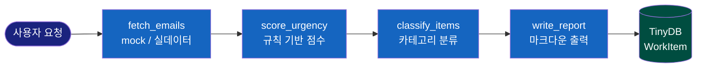
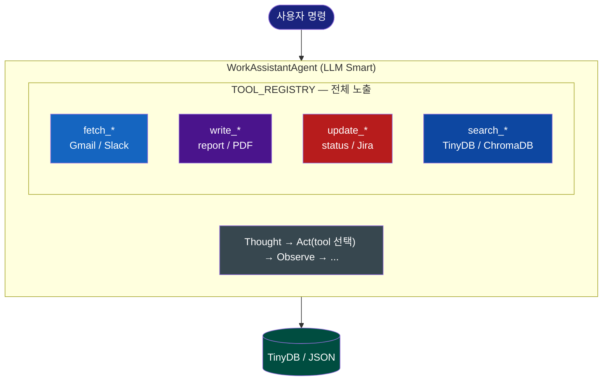
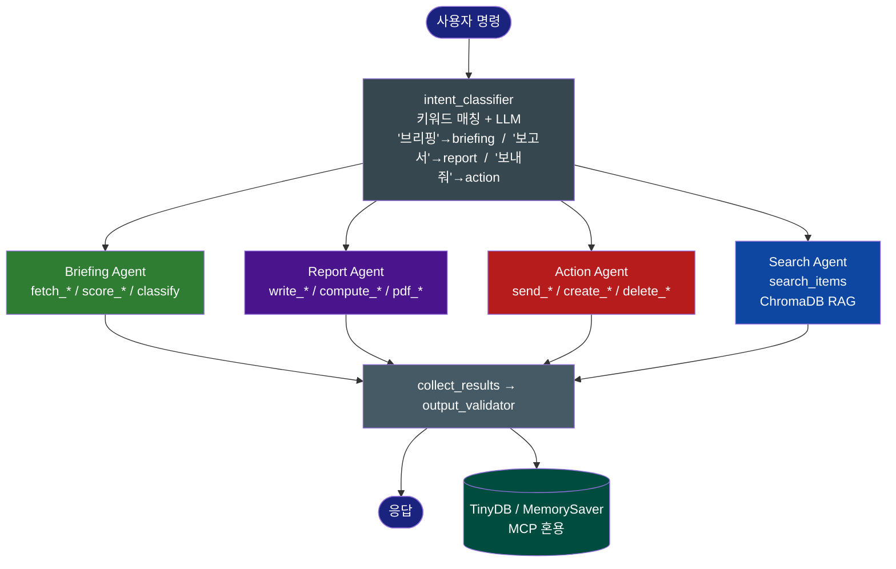
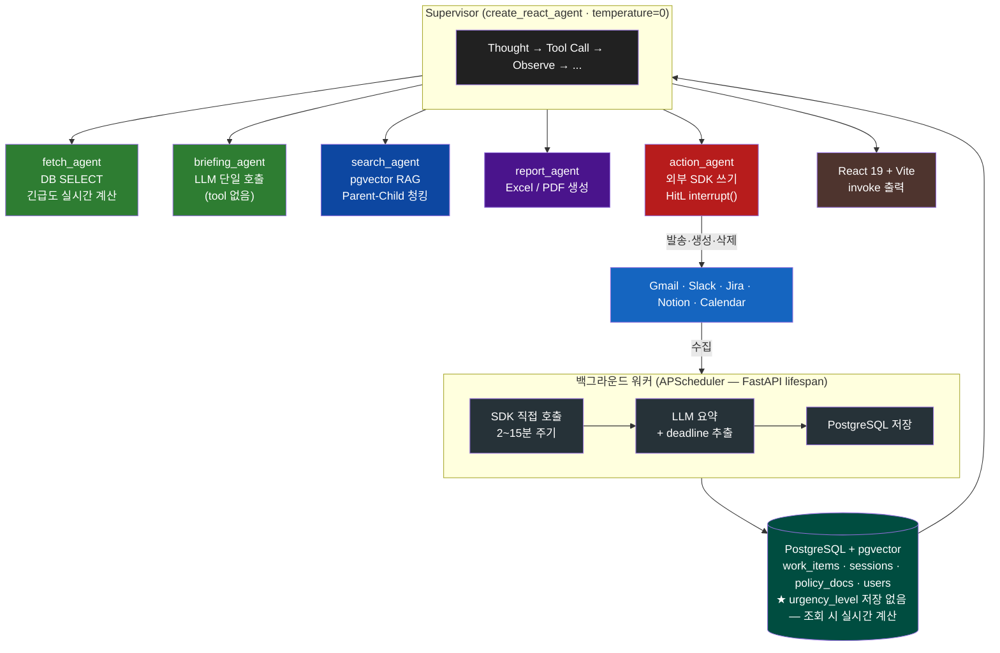

# WhatToDo — AI 멀티에이전트 업무 보조 시스템 발표 자료

## 프로젝트 개요

WhatToDo는 직장인의 업무 과부하 문제를 AI 에이전트가 해결하는 서비스입니다.

휴가를 다녀온 다음 날을 상상해보세요. 이메일 47통, 슬랙 멘션 213개, Jira 알림 8건. 어디서부터 봐야 할지 막막한 채 오전이 지나갑니다. WhatToDo는 이 문제를 "앱 하나 열면 60초 안에 긴급한 건부터 알려준다"로 바꾸는 것이 목표입니다.

---

## 팀 구성과 역할 분담

6인 팀으로 진행된 프로젝트입니다. 처음부터 역할을 명확하게 나눴습니다.

- **팀장(오케스트레이터 + 프론트엔드)**: 에이전트 핵심 루프, LLM 클라이언트, UI
- **Fetch 담당**: Gmail, Slack, Calendar 커넥터, OAuth 인증
- **Score/Classify 담당**: 긴급도 계산 엔진, 항목 분류
- **Write 담당**: 보고서 생성, 답장 초안, PDF 출력
- **Action/Search 담당**: 상태 관리, 항목 검색, DB CRUD
- **Compute/Data 담당**: 통계 집계, 정산 파싱, 스케줄러

팀원마다 독립적으로 개발하면서도 `WorkItem` 스키마 하나로 연결되는 구조를 프로젝트 초반에 합의로 확정했습니다. 이 결정이 이후 병렬 개발의 기반이 됐습니다.

---

## 아키텍처 진화: 4단계

이 프로젝트의 핵심은 아키텍처가 네 단계에 걸쳐 진화했다는 점입니다. 각 단계는 이전 단계의 한계를 발견하고 나서야 자연스럽게 다음 단계로 나아갔습니다.

```
1단계  고정 워크플로우    함수 파이프라인, LLM 없음
   ↓
2단계  단일 에이전트      tool_use 루프, LLM이 순서 결정
   ↓
3단계  키워드 Router      의도 분류 → 전담 SubAgent
   ↓
4단계  Supervisor + ReAct Orchestrator가 SubAgent를 tool로 호출
```

---

### 1단계 — 고정 워크플로우: 함수 파이프라인



LLM이 전혀 없습니다. mock 데이터를 넣으면 각 함수가 데이터를 변환해 다음 함수에 넘깁니다. 목적은 `WorkItem` 스키마가 팀 전체를 실제로 연결하는지 검증하는 것이었습니다.

이 접근의 가치: 에이전트가 잘못 동작할 때 "LLM 판단 문제인가, tool 로직 문제인가"를 분리할 수 있습니다. 파이프라인이 먼저 정확하게 동작해야 에이전트를 올릴 수 있습니다.

이 시기에 LLM을 `messages.create`로 직접 호출하는 방식도 병행했습니다. tool_use가 아닙니다. 목적은 LLM 응답 형식을 파악하는 것이었습니다. "이 항목들을 분류해줘"라고 보내면 어떤 포맷으로 돌아오는가, 파싱이 어떻게 깨지는가. tool_use 루프를 만들기 전에 LLM과의 인터페이스를 먼저 이해했습니다.

---

### 2단계 — 단일 에이전트: tool_use 루프



핵심 변화는 "코드가 순서를 정하는 것"에서 "LLM이 순서를 정하는 것"으로의 전환입니다. "정산 리포트 작성해줘"라고 하면 에이전트가 스스로 fetch → parse → compute → write_report 순서를 결정합니다.

Google OAuth 연결로 Gmail과 Calendar 실데이터가 들어오기 시작했습니다. 보고서 PDF 생성(일일/주간/월간), 맞춤법 검사 tool도 이 시기에 추가됐습니다.

**한계**: tool이 15개를 넘어서자 단일 에이전트의 tool 선택 정확도가 낮아졌습니다. "메일 답장 써줘"라고 했을 때 관련 없는 Jira tool을 호출하거나, 불필요한 중간 단계를 삽입하는 경우가 늘었습니다. tool이 많아질수록 LLM의 선택 공간이 넓어지고, 선택 오류 확률도 높아진다는 사실을 확인했습니다.

---

### 3단계 — 키워드 Router + 전담 SubAgent



각 SubAgent는 자신의 도메인 tool만 갖습니다. Slack 발송, Jira 업데이트, Notion 수정, Calendar 이벤트 생성/삭제까지 전 서비스 CRUD가 이 단계에서 완성됐습니다.

**한계**: 구조가 동작하면서 세 가지 문제가 드러났습니다. 첫째, fetch 결과를 report에 전달하려면 graph edge를 수동으로 추가해야 했습니다. 둘째, SubAgent 결과가 다음 SubAgent 입력으로 쓰이지 않았습니다. 셋째, 수집 실패 시 부분 진행 같은 동적 판단을 정적 그래프로는 표현할 수 없었습니다.

---

### 4단계 — Supervisor + ReAct 패턴 (현재)



이 구조에서 "fetch 결과를 briefing에 넘겨라"는 graph edge가 아니라 프롬프트 규칙으로 자동 성립합니다. Supervisor가 판단해서 필요하면 재수집하고, 필요하면 다음 SubAgent로 결과를 전달합니다.

---

## 긴급도 계산: 설계 원칙

긴급도 계산이 다른 시스템과 구별되는 핵심 설계입니다.

```
수집 시점 (백그라운드 워커)
  raw_content → LLM → deadline 추출 → DB 저장
  ("내일까지" → "2026-06-06T18:00:00" 으로 변환해서 저장)
  urgency_level은 저장하지 않음

조회 시점 (fetch_agent 응답 생성)
  deadline - now = 남은 시간
  남은 시간 → urgency_level (1~10) 실시간 계산
```

urgency_level을 DB에 저장하지 않는 이유: 어제 저장된 "긴급도 3"은 오늘 조회하면 "긴급도 7"이 돼야 합니다. 마감이 가까워질수록 점수가 올라가야 하는데, 저장된 값은 갱신 주기에 묶입니다. 조회 시점에 계산하면 항상 현재 기준의 정확한 점수가 나옵니다.

---

## 서브에이전트별 역할과 현실

Supervisor 아래에 다섯 개의 SubAgent가 있습니다. 각각의 완성도에는 솔직하게 차이가 있습니다.

### fetch_agent — 안정적

Gmail, Slack, Calendar, Jira, Notion에서 수집된 항목을 DB에서 조회합니다. 실제 API 호출은 백그라운드 워커가 처리하므로, fetch_agent는 DB SELECT만 실행합니다. 응답 시 `deadline`과 현재 시각 기반으로 긴급도를 실시간 계산해 구조화된 JSON을 반환합니다. fetch → briefing 흐름은 실용적으로 동작합니다.

### briefing_agent — 안정적

fetch_agent가 수집한 데이터를 받아 긴급/중요/일반 3단계 마크다운 브리핑으로 정리합니다. tool 없이 LLM 단일 호출로 빠르게 처리됩니다.

### search_agent — 안정적

DB 항목 검색과 사내 규정 RAG 조회를 담당합니다. pgvector 기반 의미 검색으로 규정집 관련 질문에 답합니다.

### report_agent — 부분 완성

주간·월간 업무 보고서와 경비 정산 리포트를 생성합니다. 파일 업로드·파싱·PDF 출력까지는 동작합니다. 다만 복잡한 정산 시나리오(항목이 많거나 규정 예외 케이스)에서 LLM 판단 오류가 간헐적으로 발생합니다.

### action_agent — 기능은 있으나 불안정

가장 범위가 넓고 가장 미숙한 에이전트입니다. Gmail 발송/삭제, Slack 메시지 발송/삭제, Jira 이슈 생성·상태변경·댓글, Notion 페이지 CRUD, Calendar 이벤트 관리까지 25개 tool을 갖습니다.

문제는 tool이 많아지면서 생기는 선택 오류입니다. "박팀장 Slack DM 답장 보내줘"에서 source_id를 잘못 파싱하거나, 스레드 답글이 아닌 새 메시지로 발송하는 경우가 있습니다. 파괴적 액션(발송·삭제)은 HitL로 코드에서 강제 차단하고 있어 오작동이 실제 피해로 이어지는 것은 방지하고 있습니다. 하지만 "원하는 대로 한 번에 실행된다"는 신뢰도는 아직 부족합니다.

---

## 기술 선택과 그 이유

### 외부 서비스 연결: MCP → SDK 직접 호출

초기에는 Slack, Jira, Notion을 MCP(Model Context Protocol)로 연결했습니다. 표준 프로토콜이고 에이전트와의 통합이 자연스럽다고 판단했습니다.

실제로 겪은 문제는 두 가지였습니다. 첫째, **정확도 불안정**: MCP가 반환하는 출력 형식이 비결정적이었습니다. 같은 Slack 메시지를 조회해도 때로는 JSON, 때로는 자연어 설명이 섞여 돌아왔습니다. 에이전트가 이 출력을 파싱해야 하는데, 형식이 불규칙하면 tool call 결과를 신뢰하기 어렵습니다. 둘째, **프로세스 불안정**: MCP stdio 방식은 별도 프로세스를 띄웁니다. Windows 환경에서 크래시가 잦았고, 프로세스가 죽으면 에이전트가 무한 대기 상태에 빠졌습니다.

SDK 직접 호출로 전환하면서 얻은 것: 응답 형식이 고정됩니다. `slack_sdk`가 반환하는 `{"ok": true, "ts": "..."}` 구조는 항상 동일합니다. 에이전트 입장에서 tool 결과가 예측 가능해졌고, tool call 정확도가 올라갔습니다.

**지연 시간 문제와 DB 레이어**: SDK 직접 호출로 전환하면서 새로운 문제가 생겼습니다. 매 대화마다 Gmail API, Slack API를 실시간으로 호출하면 응답 시간이 수 초씩 걸립니다. 이를 해결하기 위해 DB 레이어를 추가했습니다. 백그라운드 워커가 주기적으로 수집해서 PostgreSQL에 저장하고, 에이전트는 DB를 조회합니다. 실시간성은 약간 떨어지지만 응답 속도가 크게 개선됐습니다.

### RAG 청킹 전략: 실험 과정과 계층적 청킹 선택

사내 규정 RAG를 구현하면서 Ragas 프레임워크로 청킹 전략을 체계적으로 평가했습니다.

**평가 지표 (Ragas)**

| 지표 | 의미 |
|------|------|
| Context Precision | 검색된 청크가 실제로 답변에 필요한 내용인지 |
| Context Recall | 정답에 필요한 내용이 검색 결과에 포함됐는지 |
| Faithfulness | 생성된 답변이 검색 결과에만 근거하는지 (할루시네이션 방지) |
| Answer Relevancy | 답변이 질문에 직접적으로 대응하는지 |

평가 데이터셋: 사내 규정 PDF 기반 질문 20개, 각 전략별 동일 조건 실행.

**5대 청킹 전략 비교**

fixed / recursive / structure / semantic / hierarchical 다섯 가지 전략을 동일 데이터셋에 적용했습니다. 결과는 전략 간 수치 차이가 크지 않았습니다. Context Precision·Recall은 0.88~0.90대로 대부분 유사하고, Faithfulness에서 structure 방식이 상대적으로 낮게 나왔습니다.

수치만 보면 "전략이 크게 중요하지 않다"는 결론이 나올 수 있습니다. 하지만 계층적 청킹을 선택한 이유는 수치가 아니라 **문서 구조와의 적합성**입니다.

**왜 계층적 청킹인가**

사내 규정 문서는 조항 번호와 계층 구조가 명확합니다.

```
3장. 출장 여비 규정
  3.1절. 교통비 지급 기준
    3.1.1. 근무지 내 출장 시
      - 편도 20km 미만: 10,000원
      - 편도 40km 미만: 20,000원
```

고정 크기 청킹으로 자르면 "편도 20km 미만: 10,000원"만 검색되고, 이 금액이 어느 조건(근무지 내, 교육훈련 등)에 해당하는지 규정 구조가 사라집니다.

계층적 청킹은 두 종류의 청크를 만듭니다:
- **Child 청크** (C150~C300자): 조항 단위 세부 내용 — 벡터 검색에 사용
- **Parent 청크** (P1500자): Child가 속한 챕터 전체 — LLM에 전달

"출장 교통비 한도"를 질문하면 Child 청크(3.1.1 조항)가 벡터로 검색되고, 해당 조항이 속한 3.1절 전체(Parent)가 LLM에 전달됩니다. 숫자와 조건이 함께 전달되어 맥락 있는 답변이 나옵니다.

**파라미터 튜닝 결과**

8대 조합(V1) → 9대 정밀 조합(V2)으로 두 차례 실험했습니다.

V1 주요 결과 (Parent 크기 × Child 크기):

| 조합 | Context Precision | Recall | Faithfulness | Relevancy |
|------|-----------------|--------|-------------|-----------|
| P1500 × C150 | 0.929 | **0.938** | **0.963** | 0.777 |
| P800 × C150 | **0.946** | 0.775 | 0.908 | **0.807** |
| P1500 × C300 | 0.892 | 0.850 | 0.899 | 0.780 |
| P600 × C100 | 0.771 | 0.775 | 0.792 | 0.596 |

V2 정밀 튜닝 (P1500 고정 후 Child 크기 세분화):

| 조합 | Context Precision | Recall | Faithfulness |
|------|-----------------|--------|-------------|
| **P1500 × C150** | **0.983** | 0.850 | **0.921** |
| P1300 × C250 | 0.867 | **0.900** | 0.825 |
| P1500 × C300_HighOverlap | 0.867 | 0.750 | 0.838 |

**선택: Parent 1500자 × Child 150자**

V1·V2 모두에서 이 조합이 Context Precision과 Faithfulness에서 가장 높았습니다. Parent가 너무 작으면(P600) 맥락이 부족하고, Child가 너무 크면(C400 이상) 검색 정밀도가 떨어졌습니다. Child 오버랩(HighOverlap) 변형은 Recall 향상을 기대했으나 유의미한 차이가 없었습니다.

임베딩 모델은 `text-embedding-3-large`(실험), 최종 서비스에는 `jhgan/ko-sroberta-multitask`(한국어 특화 무료 모델)를 사용했습니다. 벡터 저장소는 ChromaDB(실험) → pgvector로 전환해 PostgreSQL 하나로 관계형 데이터와 벡터 검색을 통합했습니다.

### 데이터 저장소: TinyDB → PostgreSQL + pgvector

처음에는 파일 기반 TinyDB로 시작했습니다. PostgreSQL 마이그레이션이 필요해진 이유는 두 가지입니다. LangGraph의 대화 이력 영속성(AsyncPostgresSaver), 그리고 pgvector 벡터 검색. 하나의 DB로 관계형 데이터·대화 이력·벡터 검색을 모두 처리하면서 인프라가 단순해졌습니다.

### 프론트엔드: Streamlit → React + Vite

실시간 스트리밍과 인터랙션 요구사항이 Streamlit의 한계를 넘었습니다. React 19 + Vite로 전환하면서 SSE(Server-Sent Events) 스트리밍을 구현했습니다. 이벤트는 세 종류입니다.

- `delta`: LLM이 생성하는 텍스트 조각
- `structured`: 카드 데이터, 파일 다운로드 링크
- `done`: 스트림 종료

---

## HitL (Human-in-the-Loop)

"이메일 발송", "Slack 메시지 전송", "Jira 이슈 수정" 같은 파괴적 액션은 사용자 확인 없이 실행되면 안 됩니다. LangGraph의 `interrupt()` 메커니즘으로 구현했습니다.

에이전트가 파괴적 액션을 취하려 하면 실행을 중단하고 사용자에게 확인을 요청합니다. 승인을 받으면 그 시점부터 다시 실행합니다. 중요한 것은 이 체크가 **Python 코드로 강제**된다는 점입니다. 프롬프트 지시만으로는 충분하지 않습니다.

---

## 주요 기능 상세

### 복귀 브리핑

"3일 쉬고 왔어. 뭐 쌓였는지 정리해줘"

에이전트가 DB에서 Gmail, Slack, Calendar, Jira, Notion 항목을 조회합니다. 저장된 deadline 기준 남은 시간으로 1~10점을 실시간 계산합니다. 결과를 카드 형태로 보여줍니다.

- 🔴 긴급 (3건): 계약서 서명, 배포 승인, 예산 승인
- 🟡 중요 (7건): 주간 회의 준비 외
- 🟢 일반 (180건): 접혀 있음

긴급도는 AI의 주관적 판단이 아닙니다. "마감이 얼마나 남았는가" 같은 정량 지표 기반입니다.

### 답장 초안 작성

"박팀장 DM 답장 초안 써줘"

에이전트가 Slack에서 해당 스레드 전체를 가져와 맥락을 파악한 뒤 초안을 생성합니다. 초안은 확인 후 직접 복사하거나, 명시적 승인을 받아 발송할 수 있습니다.

### 경비 정산

영수증 이미지나 텍스트를 올리면 항목(날짜, 가맹점, 금액, 카테고리)을 자동 추출합니다. 사내 규정 RAG와 연동하면 "식대 3만2천원이 규정 한도 3만원을 초과합니다"까지 자동으로 검증합니다. 최종 정산서는 Excel로 내보낼 수 있습니다. 스캔 PDF도 Vision OCR로 처리합니다.

### 사내 규정 검색

규정집 PDF를 업로드해두면 자연어 질문으로 즉시 조회합니다. "해외 출장 일비 규정"처럼 정확한 키워드를 몰라도 됩니다.

### 보고서 자동 생성

일일, 주간, 월간 업무보고서를 공문서 형식 PDF로 생성합니다.

---

## 성능 평가 시스템

### 평가 방법론: TheAgentCompany 기반 적용

NeurIPS 2025에 발표된 TheAgentCompany(Xu et al., CMU 2024)는 LLM 에이전트를 실제 업무 환경에서 평가하는 벤치마크입니다. GitLab, Plane(Jira 대안), RocketChat, OwnCloud로 구성된 자체 호스팅 사내 환경을 구축하고 SDE/PM/DS/HR/Finance 등 직무별 175개 태스크를 평가합니다.

논문의 핵심 평가 원칙:
- **체크포인트 기반 부분 점수**: 태스크를 완전히 수행하지 못해도 완료된 중간 단계만큼 점수 인정
- **단계별 그래뉼러 평가**: 전체 성공률과 별도로 subtask 완료율을 측정
- **현실 업무 반영**: 브라우징, 코드 실행, 동료 커뮤니케이션 등 복합 작업 포함

논문 결과: 최강 모델 Gemini-2.5-Pro도 175개 태스크에서 **30.3% 완전 성공**, GPT-4o는 **8.6%**에 그쳤습니다.

우리는 이 방법론을 WhatToDo 도메인에 맞게 직접 구현했습니다. WhatToDo 평가에서 gpt-4o-mini가 75%로 높게 나온 것은 직접 비교 대상이 아닙니다. TheAgentCompany는 "채용 후보 스크리닝 후 면접 일정 잡기"처럼 27+ 단계가 필요한 장기 태스크 175개를 평가합니다. WhatToDo 평가는 "최근 메일 3개 요약해줘" 같은 단발성 대화 태스크 12개입니다. **방법론(체크포인트 기반 부분 점수)을 참고했을 뿐, 수치는 다른 난이도 기준입니다.**

### 평가 지표

- **Success Rate**: 모든 체크포인트를 통과한 시나리오 비율 (완전 성공)
- **Partial Score**: `0.5 × (획득 점수 / 총 점수) + 0.5 × 완전 성공 여부` — 부분 달성도 인정
- **Tool Call Accuracy**: 첫 체크포인트 기준 올바른 에이전트/tool을 호출했는지 여부
- **Hallucination Rate**: "없는 정보를 만들어냈는지" 체크포인트 통과율

### 시나리오 설계

12개 시나리오, 5개 카테고리:

| 카테고리 | 시나리오 | 핵심 체크포인트 |
|---------|---------|-------------|
| briefing (브리핑) | S1: 전체 업무 브리핑 | 복수 소스 수집, 출처 명시 |
| action (액션) | S2: 메일 답장 초안, S10: 상태 변경 | 초안 형식, 실제 상태 변경 반영 |
| search (검색) | S3: 사내 규정, S4: Jira, S5: 캘린더, S6: Gmail, S9: Notion, S12: Slack | 정확한 데이터 반환, 할루시네이션 없음 |
| report (보고서) | S7: KPI 보고서, S8: 영수증 정산 | 파일 생성(PDF/xlsx), 항목 정확도 |
| multi_intent (복합) | S11: 브리핑 + 보고서 동시 | 두 에이전트 순차 호출, 결과 통합 |

각 시나리오는 3~5개 체크포인트로 구성됩니다. 예를 들어 S11 "긴급 업무 브리핑하고 일간 보고서도 작성해줘"의 체크포인트:
1. briefing 에이전트 호출 확인 (3점)
2. report 에이전트 호출 확인 (3점)
3. 두 결과가 모두 포함된 최종 응답 (4점)

### 평가 결과

**gpt-4o vs gpt-4o-mini — 12개 시나리오 동일 조건 실행**

| 지표 | gpt-4o | gpt-4o-mini |
|------|--------|-------------|
| **Success Rate** | 41.7% (5/12) | **75.0% (9/12)** |
| **Avg Partial Score** | 0.608 | **0.812** |
| Tool Call Accuracy | 100% | 100% |
| Hallucination 방지 | 67% (4/6) | **83% (5/6)** |

**카테고리별 Partial Score:**

| 카테고리 | gpt-4o | gpt-4o-mini |
|---------|--------|-------------|
| 브리핑 | 40% | 40% |
| 액션 | 68% | **100%** |
| 검색 | 54% | **72%** |
| 보고서 | **100%** | **100%** |
| 복합 의도 | 30% | **100%** |

**시나리오별 상세 (Partial Score):**

| 시나리오 | gpt-4o | gpt-4o-mini | 비고 |
|---------|--------|-------------|------|
| S1 전체 브리핑 | 0.40 | 0.40 | 공통 약점: Gmail 미반영 |
| S2 메일 답장 초안 | 0.35 | **1.00** | 4o: 답장 형식 미완성 |
| S3 사내 규정 조회 | 0.35 | **1.00** | 4o: 할루시네이션 의심 |
| S4 Jira 이슈 검색 | 0.35 | 0.15 | 공통 약점: 연동 불안정 |
| S5 캘린더 일정 | 1.00 | 1.00 | 공통 완전 성공 |
| S6 Gmail 조회 | 0.35 | **1.00** | 4o: 할루시네이션 판정 |
| S7 KPI 보고서 | 1.00 | 1.00 | 공통 완전 성공 |
| S8 영수증 정산 | 1.00 | 1.00 | 공통 완전 성공 |
| S9 Notion 검색 | 0.20 | 0.20 | 공통 약점: 토큰 만료 |
| S10 상태 변경 | 1.00 | 1.00 | 공통 완전 성공 |
| S11 복합 의도 | 0.30 | **1.00** | 4o: 두 번째 에이전트 미호출 |
| S12 Slack 검색 | 1.00 | 1.00 | 공통 완전 성공 |

### 핵심 발견

**① gpt-4o-mini가 gpt-4o를 앞선다**

Success Rate 기준 75% vs 41.7%. 에이전트 태스크에서 모델 크기와 성능이 비례하지 않습니다. gpt-4o는 tool 호출 패턴보다 과도하게 추론하는 경향이 있어 단순 액션 수행에서 오히려 실수가 많았습니다. 구조화된 tool use 태스크에서는 작고 명확하게 따르는 모델이 유리합니다.

**② 복합 의도(multi_intent)가 가장 큰 차이**

S11 "브리핑 + 보고서 동시 요청" — gpt-4o 0.30 vs gpt-4o-mini 1.00. Supervisor ReAct 루프에서 두 SubAgent를 순서대로 호출하는 패턴을 mini가 훨씬 안정적으로 수행했습니다. gpt-4o는 두 번째 에이전트 호출을 생략하고 응답을 완료하는 경향이 있었습니다.

**③ 공통 약점: S4(Jira)와 S9(Notion)**

두 모델 모두 낮은 점수입니다. 이것은 모델 문제가 아니라 인프라 문제입니다. S4는 평가 시점의 Jira 연동 불안정, S9는 Notion API 토큰 만료가 원인입니다. 평가 시스템이 모델의 판단력 문제와 시스템 연동 문제를 분리해서 보여준다는 점에서 평가 파이프라인 자체의 가치가 확인됐습니다.

**④ Tool Call Accuracy는 두 모델 모두 100%**

어떤 에이전트를 불러야 하는지(fetch vs search vs action 등)는 두 모델 모두 완벽하게 판단했습니다. Supervisor의 라우팅 역할이 안정적으로 동작하고 있습니다.

### 응답 시간 관찰

LangSmith로 지연 시간·토큰 사용량을 정량 모니터링하려 했으나 시간 및 토큰 부족으로 완료하지 못했습니다. 체감 기준으로 확인한 수치입니다.

| 작업 유형 | 관찰 응답 시간 | 예시 |
|---------|------------|------|
| 단순 작업 | 20~30초 | 브리핑, 단일 검색, 상태 변경 |
| 복합 작업 | 1분 내외 | 브리핑 + 보고서 동시, 경비 정산 |

한 가지 명확하게 확인된 점은 **DB 레이어 도입 효과**입니다. SDK 직접 호출 방식(매 대화마다 Gmail·Slack API 실시간 호출)에서 DB 캐싱 방식으로 전환한 후 체감 지연 시간이 대폭 감소했습니다. 외부 API 응답 대기 시간이 제거되고 PostgreSQL SELECT로 대체됐기 때문입니다.

```bash
# 평가 실행
uv run python -m eval.run_eval
uv run python -m eval.compare --runs 5
```

---

## 인증과 다중 사용자

처음에는 단일 사용자 환경으로 시작했습니다. 팀 프로젝트 특성상 빠른 데모가 우선이었습니다.

다중 사용자 지원은 이후 추가됐습니다. JWT 기반 인증, Refresh Token 관리, OAuth 토큰 AES-256 암호화. 사용자마다 자신의 Gmail, Slack, Jira 연동을 독립적으로 설정합니다.

보안 원칙: 외부 서비스 OAuth 토큰은 암호화해서 저장합니다. 메시지 원문은 처리 후 요약본만 보관합니다.

---

## Docker와 배포 구조

```
db       (pgvector/pgvector:pg17) — PostgreSQL + 벡터 검색
backend  (FastAPI + LangGraph)    — AI 에이전트, API 서버
frontend (React + Vite → nginx)  — 사용자 인터페이스

호스트 접근:
  http://localhost      → React 앱 (nginx)
  http://localhost:8000 → FastAPI (내부 참조)
  DB는 컨테이너 내부 통신만
```

---

## 개발하면서 배운 것들

### 1. 인터페이스 합의가 병렬 개발의 핵심이다

초기에 합의한 `WorkItem` 스키마 덕분에 Fetch 담당자가 Gmail 커넥터를 만드는 동안 Write 담당자는 mock 데이터로 보고서 생성을 개발할 수 있었습니다.

### 2. MCP는 내부 지식 기반에, SDK는 실시간 서비스 연동에

MCP는 LLM이 도구를 발견하는 방식으로 유용하지만, 외부 서비스 연동에서는 응답 형식의 비결정성이 문제였습니다. SDK 직접 호출은 출력 구조가 고정되어 에이전트의 tool 결과 해석 정확도가 높아집니다. 어떤 방식이 항상 옳은 것이 아니라, 연결하는 대상에 따라 선택이 달라집니다.

### 3. 프롬프트보다 코드로 강제하라

파괴적 액션을 프롬프트 지시로만 막으려 하면 LLM이 지시를 무시할 수 있습니다. Python 코드로 실행 전에 차단하는 것이 훨씬 안전합니다.

### 4. 정적 그래프의 한계를 일찍 발견했다

키워드 Router 구조는 단일 에이전트보다 정확했지만, 에이전트 간 결과를 넘기는 흐름이 필요해지자 한계가 드러났습니다. Supervisor 패턴이 동적 흐름에 더 맞는 선택이었습니다.

### 5. 도구가 많다고 능력이 늘지는 않는다

action_agent는 25개 tool을 갖지만, tool이 많아질수록 LLM의 선택 오류도 증가했습니다. 범위가 좁고 명확한 SubAgent가 범용 에이전트보다 예측 가능합니다.

### 6. 상태를 저장할 것인가, 계산할 것인가

긴급도를 DB에 저장하면 갱신 주기에 묶여 실제 시간 경과를 반영하지 못합니다. "저장 비용이 낮은 것"과 "계산이 항상 정확한 것"을 구분하는 것이 중요했습니다.

### 7. 평가 없이 개선할 수 없다

"왠지 더 잘 되는 것 같다"는 느낌이 아니라 Success Rate, Tool Call Accuracy 같은 정량 지표로 확인해야 합니다.

---

## 현재 상태와 앞으로

### 완성된 것들

- 복귀 브리핑, 답장 초안, 경비 정산, 보고서 생성, 사내 규정 검색
- Gmail, Google Calendar, Slack, Jira, Notion 연동
- LangGraph Supervisor 패턴 + HitL
- invoke 형식 출력 UI (현재 동작 표시 + 완료 후 결과 반환)
- 다중 사용자 인증 및 토큰 암호화
- Parent-Child 계층적 청킹 기반 pgvector RAG
- Docker Compose 배포 구성
- 모델 비교 평가 시스템

### 보완이 필요한 것들

- action_agent: tool 선택 오류 감소 (few-shot 예시 추가, tool 분리)
- report_agent: 복잡한 정산 시나리오에서의 LLM 판단 안정화
- 실시간 수집과 DB 캐시 간 갱신 주기 최적화

### 앞으로 할 것들

- EC2 프로덕션 배포 (nginx + HTTPS)
- 모바일 PWA
- 팀 대시보드 (팀 전체 업무 현황)
- 주간 KPI 자동 리포트 (APScheduler 스케줄링)

---

## 마무리

WhatToDo는 3주 만에 기획부터 멀티에이전트 시스템까지 구현한 프로젝트입니다.

아키텍처는 4단계에 걸쳐 진화했습니다. 각 단계의 한계를 직접 겪고 나서야 다음 단계로 나아갔습니다. 고정 워크플로우의 경직성, 단일 에이전트의 tool 선택 오류, 키워드 Router의 체인 불가 문제를 차례로 해결하다 보니 Supervisor + ReAct 패턴에 도달했습니다.

AI 에이전트는 "뭔가 신기한 것"이 아닙니다. 사람이 반복적으로 하는 업무를 정확하게 식별하고, 그것을 tool로 분해하고, LLM에게 언제 어떤 tool을 쓸지 판단하게 하는 것입니다. 그리고 그 판단이 틀릴 때 어떻게 통제할 것인지를 코드로 정의하는 것입니다.
